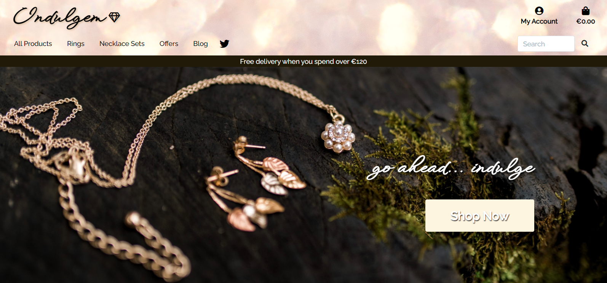
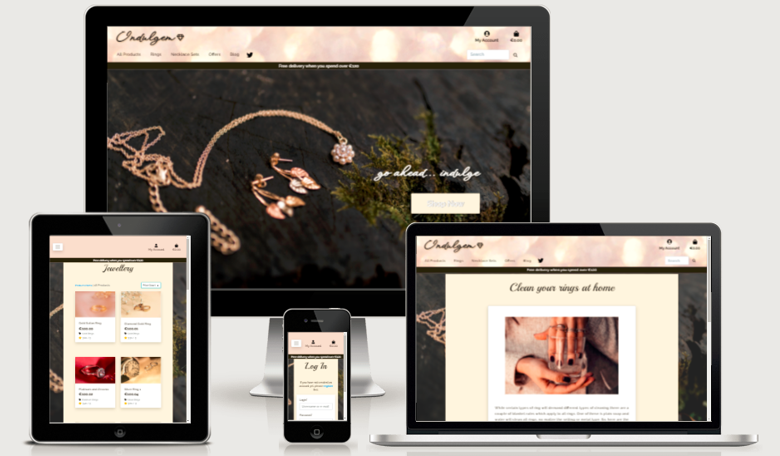
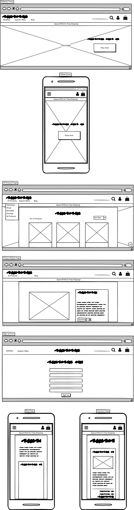
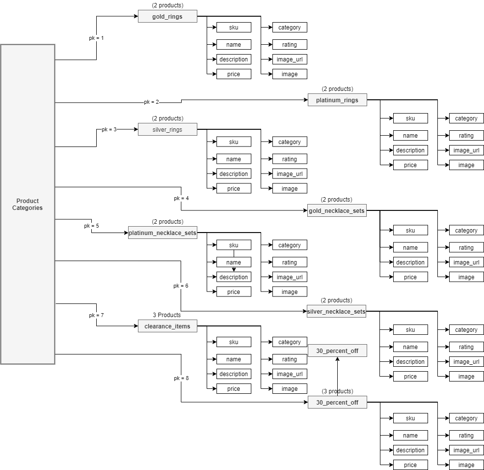
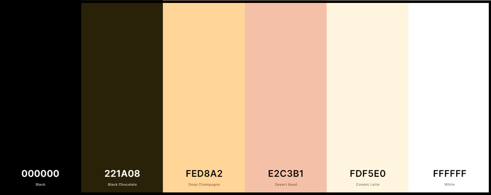
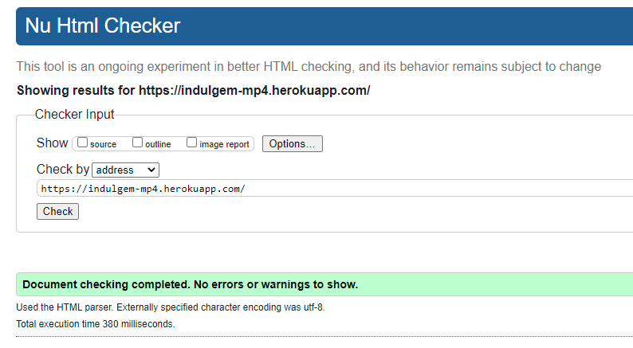
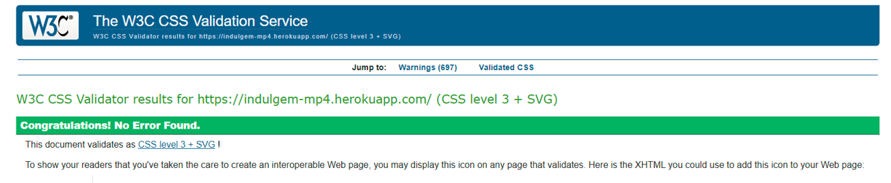
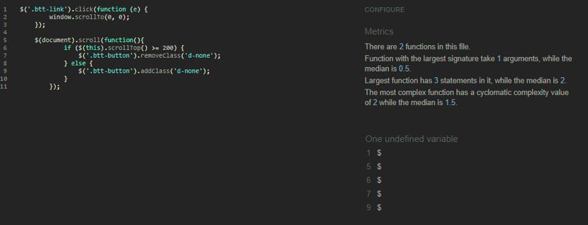
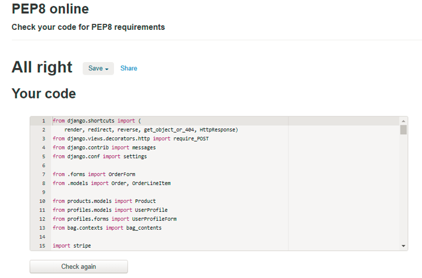

# **Milestone Project 4**  &nbsp;
# Table of Contents
1. [Purpose and Features](#purpose)
2. [Site Pages and Menu](#sitepgs)
	1. ['Home' page](#homepage)
	2. ['Navigation Menu'](#navmenu)
	3. ['All Products'](#allproducts)
	4. ['Product Details'](#pdetails)
	5. ['Edit Product' page](#edproduct)
	6. ['Shopping Bag' page](#bag)
	7. ['Checkout' page](#checkout)
	8. ['Sign Up' pages](#signup)
	9. ['Log In' page](#login)
	10. ['Profile'](#profile)
	11. ['Blog' page](#blog)
	12. ['Blog Details' page](#blogdetails)
	13. ['Edit Blog' page](#editblog)
	14. ['Add Blog' pages](#myaccount)
	15. ['Product Management' page](#pmanage)
	16. ['Logout' page](#logout)
3. [Responsivity](#responsivity)
4. [Design](#design)
	1. [Wireframes](#wireframes)
	2. [Schema](#schema)
	3. [Colour Palette](#palette)
	4. [Images](#images)
	5. [Typography](#typography)
	6. [Current Features](#current)
	7. [Future Features](#future)
5. [UX (User Experience)](#userexperience)
	1. [Strategy Plane](#strategy)
	2. [Scope Plane](#scope)
	3. [Structure Plane](#structure)
    4. [Skeleton Plane](#skeleton)
	5. [Surface Plane](#surface)
6. [User Stories](#userstories)
	1. [Viewing and Navigation](#van)
	2. [Registration and User Accounts](#reg)
	3. [Sorting and Searching](#sorts)
	4. [Purchasing and Checkout](#pac)
	5. [Admin and Store Management](#adminsm)
7. [Testing](#testing)
    1. [Non-Admin User Testing](#usertesting)
	2. [Admin User Testing](#admintesting)
	3. [Defensive User Testing](#defensive)
	4. [App Tests](#apptest)
	5. [Bug Fixes](#bugfixes)
8. [Validation](#validation)
9. [Technologies](#technologies)
10. [Deployment](#deployment)
11. [Credit and Acknowledgements](#credits)
	1. [Mentor](#mentor)
	2. [Code](#code)
	3. [Images](#imagesa)
	4. [Text Content](#textcontent)  


# Indulgem Jewellery Store - Milestone Project 4

- GitHub Repository: https://github.com/Saraholoughlin5/Milestone_Project_4
- Heroku App: https://indulgem-mp4.herokuapp.com/

 "Indulgem Homepage" )  
Adapted from the Boutique Ado project, (Code Institute)

### **Purpose and Features**<a name="purpose"></a>
For this milestone project I have built an e-commerce jewellery store. Features include easily navigated and sorted products, a blog and blog commenting.  
Users can sign up, view their profile, view products, change product size where applicable and increase/decrease quiantity (max: 5), add items to the shopping bag, use Stripe payments, checkout, and receive confirmation emails.  
The can also view the blog page, which displays a summary of all available blogs, and they can add comments if logged in to their profile.  
A back-to-top button has been included on the 'All Products', 'Blog' and 'Blog Details' pages.  
An Admin account can be used to add/edit/delete products. They can also add/edit/delete a blog, and add and delete comments.  
This fulfils the CRUD requirement, as users can create, read, edit and delete content, depending on their profile type.  

### **Site Pages and Menu**<a name="sitepgs"></a>

#### **'Home' page**<a name="homepage"></a>
The Indulgem homepage is accessible via the logo on desktop and via the dropdown navigation menu on smaller screens.  
The 'Home' page contains the navigation menu and a 'Shop Now' button, which links to the 'All Products' page.  
#### **'Navigation Menu**<a name="navmenu"></a>
The navigation menu on large screens contains the Indulgem logo (links to homepage), the 'My Account' and shopping bag icons/headings, a list of menu items and a search bar.  
On smaller screens, the logo is not present. A toggle button can be clicked on to reveal the menu items and search field. The 'My Account' and shopping bag icons/headings are displayed across from the toggle button.  
Clicking on a menu option (all screen sizes) displays further dropdowns where available.  

#### **'All Products' page**<a name="allproducts"></a>
This page contains a list of all products, the total number of products, a 'Sort by...' menu and a back to top button (only visible once scrolled down a minimum of 200px).  
When logged in using the Admin account, 'Edit/Delete' links are displayed.  
A 'Delete Product?' modal has been added to the delete link, to ensure that products are not accidentally removed.  
The navigation menu lists products by category, and user choices are displayed on the 'All Products' page, e.g. 'All Rings'.  

#### **'Product Details' page**<a name="pdetails"></a>
Once the user clicks on a product image on the 'All Products' page, they are redirected to the 'Product Details' page. This page contains an enlarged image of the product and a white card that displays the product details, including the title, description, cost, category, rating, size menu (if applicable), quantity input field, and 'Keep Shopping'/'Add to Bag' buttons.  
Users can change the size of some products and increase the quantity to a maximum of 5. Clicking on the 'Keep Shopping' button brings the user back to the 'All Products' page, and clicking 'Add to Bag' keeps the user on the 'Product Details' page, while displaying a success toast message and a button linked to the 'Checkout' page.

#### **'Edit Product' page**<a name="edproduct"></a>
The 'Edit Product' page is only accessible by an Admin user on the 'All Products' and 'Product Details' pages. The user can update all details of the product.

#### **'Shopping Bag' page**<a name="bag"></a>
The 'Shopping Bag' page can be accessed via the bag icon in the navigation menu, or via a 'Return To Bag' button on the 'Checkout' page. If empty, a message and a 'Keep Shopping' button is displayed. If populated, the product image, details, price, quantity and subtotal are displayed, along with the bag total, delivery cost and grand total.  
If the user has not exceeded the free delivery threshold, a message will be displayed to notify them.  
'Keep Shopping' and 'Secure Checkout' buttons are present also.

#### **'Checkout' page**<a name="checkout"></a>
The Checkout page contains the 'Order Summary' and 'Complete Order' form, as well as a card payment field (Stripe) and two buttons ('Return to Bag' and 'Pay Now').  
If not signed in, links to login or sign up are displayed. Alert text highlighting the total charge is present beneath the buttons.

#### **'Sign Up' page**<a name="signup"></a>
The sign up page can be found in the 'My Account' navigation menu item. It contains a sign up form, as well as a link to log in, a 'Home' button, and a 'Sign Up' button.  
A link to this page is also available on the checkout page, and at the bottom of the 'Blog Details' page.

#### **'Log In' page**<a name="login"></a>
Click on 'Log In' in the 'My Accounts' menu item to view the page. This page contains a login form, as well as a register link, a forgot password link, a 'Home' button and a 'Sign In' button.

#### **'Profile' page**<a name="profile"></a>
Once a user is logged in they can view their profile page, which contains their 'Order History' and 'Default Delivery Information', which can be set on the 'Checkout' page when making a purpose, if required.

#### **'Blog' page**<a name="blog"></a>
The 'Blog' page displays a panel list of summarised blogs. Each blog panel includes a title, summarised description, image and a 'Read On' button to access the 'Blog Details' page. 
The username and date/time submission information is also displayed.  
If logged in as Admin, 'Edit' and 'Delete' links are present - NOTE: there is no modal linked to the blog delete link (future feature).  
The back-to-top button is also present on this page, visible once scroll threshold is reached.
The blog can be read without logging in.  

#### **'Blog Details' page**<a name="blogdetails"></a>
The 'Blog Details' page is accessible via the 'Read On' button on the 'Blog' page. The page includes the title, image and full description, as well as the username and date/time submission information.  
A 'Comments' box is featured beneath the blog panel if comments have been added. The user, date/time and comment are displayed, as well as the total number of comments for the blog.  
'Login' and 'Signup' links are present if the user is logged out and wishes to add a comment.

#### **'Edit Blog' page**<a name="editblog"></a>
The 'Edit Blog' link is available on the 'Blog' and 'Blog Details' page, and only for an Admin user. A form is displayed for the Admin user to edit the title, description, and replace or remove the image as required. A 'Cancel' button is present if edits need to be discarded. An 'Update Blog' button is also present.  
An 'Alert' toast is displayed at the top-right of the page.

#### **'Add Blog' page**<a name="addblog"></a>
The Admin user can add a blog via the 'My Account' navigation menu item. A form is displayed for the user to enter a title, description, and upload an image.A 'Cancel' button is present if the blog needs to be discarded. An 'Add Blog' button is also present.

#### **'Product Management' page**<a name="pmanage"></a>
The 'Product Management' page can only be accessed by an Admin user. Here, the user can choose the category, enter an SKU number, name, description, price, rating and image. They can also set the 'Has sizes' feature visibility depending on the product. 'Cancel' and 'Add Product'  buttons are displayed.

#### **'Logout' page**<a name="logout"></a>
The 'Logout' page is accessible via a link in the 'My Account' navigation menu item. A confirmation message and 'Log Out' button are displayed. 


### **Responsivity**<a name="responsivity"></a>
The app is responsive on a variety of screen types and sizes, for both the server site and Heroku app.  
It has been checked via the browser tool list of responsive devices, both portrait and landscape. It has also been checked on a variety of browsers, including Chrome, Microsoft Edge, and Safari.  
The Heroku deployed app was checked on a Lenovo ThinkPad, iPhone X and Huawei MediaPad T5.  
[Bootstrap](https://www.getbootstrap.com/) classes and media queries were utilised throuhout the app to format the pages and elements.  
[Am I Responsive](http://ami.responsivedesign.is/) displays various site pages, including the homepage, log in page, all products and blog details pages.  

  
### **Design**<a name="design"></a>

#### **Wireframes**<a name="wireframes"></a>
The app display layout (desktop/mobile) was planned using Balsamiq (www.balsamiq.com). These were the initial wireframes created at the start of the project, and the final views have evolved during creation of the app.  
Online Link: https://share.balsamiq.com/c/wUTkyRkeqqndXtveXLfFyr.png
  

#### **Schema**<a name="schema"></a>
  

#### **Color Palette**<a name="palette"></a>
The colours for the Indulgem app were chosen to create a luxurious and warm feel that reflects the beauty of the jewellery.  
An online tool, [Image Colour Picker](https://www.imagecolorpicker.com/) was used to help extract colours from some of the images used on the site, including some product images and the banner background.  
The colour palette was prepared at [Coolers](https://www.coolors.com/) website:   

  

#### **Images**<a name="images"></a>
The images on the site were sourced from Pexels (www.pexels.com) and Unsplash (www.unsplash.com).  
[Font Awesome](https://fontawesome.com/) was used for the logo gem, bag, profile, twitter and secure checkout icons in the app (also used for various arrows on buttons).  
Images are not skewed or pixelated.

#### **Typography**<a name="typography"></a> 
[Google Fonts](https://fonts.google.com/) were employed for the text on the app.  
- ['WindSong'](https://fonts.google.com/specimen/WindSong?query=winds#standard-styles) font was used for the 'Indulgem' logo.  
- ['Playball'](https://fonts.google.com/specimen/Playball?query=playball) font was used for the page and modal headings throughout the app.  
- ['Raleway'](https://fonts.google.com/specimen/Raleway?query=Raleway) font was used for the main text throughout the app.  

#### **Current Features**<a name="current"></a>
- The app contains a back-to-top button on the all products and blog pages (JS)
- A search bar is present with error toast display if an empty search is performed
- A 'Sort by'... selector is available on the 'All Products' page
- A 'Quantity' selector with update/remove links
- 'Edit' and 'Delete' links are present and functional for products/blog/blog comments if Admin/Superuser
- Crispy forms are used throughout the app
- Blog and blog comments (2 new models added to the app)
- A gem Favicon is included 
- Stripe payments
- 'Sign Up' and 'Log In' pages contain links to one another for ease of use for new users  

#### **Future Features**<a name="future"></a>
- 'Delete Blog?' modal 
- Rating entry for regular users - currently only added by Admin when adding/editing a product
- Live Twitter account for user interaction 

### **UX (User Experience)** <a name="userexperience"></a>

#### **Strategy Plane**<a name="strategy"></a>
The 'Indulgem' app is designed to appeal to customers who wish to purchase elegant jewellery. The layout, colour and style are warm, yet muted and earthy, appealing and sublime, as expected based on the product. It is not loud or jarring for the customer.  
The customers this site and product appeals to  would be aptly targeted with this design and layout.

#### **Scope Plane**<a name="scope"></a>
The app use is intuitive, with dropdown menus and progress buttons where expected. Users can sign up to create a profile, log in, purchase items at various sizes and quantities, and comment on the blogs.  
Admin users can also create, edit and delete content.  
Toast messages are displayed to relay success, alert and error messages, where appropriate. 

#### **Structure Plane**<a name="structure"></a>
The structure of the app brings the users attention to the products, blogs and forms. The homepage contains an image and a single button. This image is an underlay on all remaining site pages.  
All other pages contain a light-coloured, offset overlay, which hosts the product images, for example. Forms and details contain white card backgrounds along with the overlay (product details, blogs and  for example).  
Layout design, form design and buttons are uniform and intuitive. All links and buttons work as expected per user type. 

#### **Skeleton Plane**<a name="skeleton"></a>
Balsamiq wireframes were used to plan the app layout (desktop and portrait mobile views). Media queries and bootstrap classes were used to hide/display different layouts for the shopping bag and checkout pages.  
The app layout is as intended from the start of the project.

#### **Surface Plane**<a name="surface"></a>
The colour scheme of the app was drawn heavily from the banner and background images, and are consistent in the site. The buttons format is consistent throughout the site also, with red text for cancel buttons. Text-transform was used to enlarge buttons on hover where appropriate.


### **User Stories**<a name="userstories"></a>

#### **Viewing and Navigation**<a name="van"></a>
As a Shopper I want to be able to:
- View a list of products so that I can select some products to purchase
- View individual product and services details so that I can identify the price, description, product rating, product image and available sizes
-  Quickly identify deals, clearance items and special offers so that I can take advantage of special savings on products I'd like to purchase
- Easily view the total of my purchases at any time so that I can avoid spending too much  
As a Site User I want to be able to: 
- View a blog, whether logged in or not so that I can read about items that might interest me and inform my purchases
- Add a comment to a blog so that I can take part in discussions or ask for advice
#### **Registration and User Accounts**<a name="reg"></a>
As a Site User I want to be able to: 
- Easily register for an account so that I can have a personal account and be able to view my profile
- Easily login or logout so that I can access my personal account information
- Easily recover my password in case I forget it	so that I can recover access to my account
- Receive an email confirmation after registering	so that I can verify that my account registration was successful
- Have a personalised user profile so that I can view my personal order history and order confirmation, and save my payment information.
#### **Sorting and Searching**<a name="sorts"></a>
As a Shopper I want to be able to: 
- Sort the list of available products so that I can easily identify the best rated, best priced and categorically sorted products
- Sort a specific category of product so that I can find the best priced or bets rated product in a specific category, or sort the products in that category by name
- Sort multiple categories of products simultaneously so that I can find the best priced or bets rated product across broad categories, such as "rings" or "necklace sets"
- Search for a product by name or description so that I can find a specific product I'd like to purchase
- Easily see what I've searched for and the number of results so that I can quickly decide whether the product I want is available
#### **Purchasing and Checkout**<a name="pac"></a>
As a Shopper I want to be able to: 
- Easily select the size and quantity of a product when purchasing it so that I can ensure I don’t accidentally select the wrong product quantity or size
- View items in my bag to be purchased so that I can identify the total cost of my purchase and all items I will receive
- Adjust the quantity of individual items in my bag so that I can easily make changes to my purchase before checkout
- Easily enter my payment information so that I can checkout quickly and with no hassle
- Feel my personal and payment information is safe and secure so that I can confidently provide the needed information to make a purchase
- View an order confirmation after checkout so that I can verify that I havent made any mistakes
- Receive an email confirmation after checking out so that I can keep the confirmation of what I have purchased for my records
- Make purchases if I have no profile so that I can buy from the store without requiring a user account
#### **Admin and Store Management**<a name="adminsm"></a>
 As a Store Owner I want to be able to: 
- Add a product so that I can add new items to my store
- Edit/Update a product so that I can change product prices, descriptions, images and other product criteria
- Delete a product so that I can remove items that are no longer for sale
- Add a blog so that I can interest new site users and shoppers
- Edit/Update a blog so that I can rewrite if necessary or change an image
- Delete a blog or blog comment so that blogs can be replaced and comments are policed


### **Testing**<a name="testing"></a>
User testing was carried out throughout the project to ensure that the site operates as expected during creation, and when deployed.  
Site navigation, links, buttons and forms were tested for correct functionality, along with various features (edit, delete, update, remove, checkout, sign up and more).  
App testing was carried out at various stages when setting up the app. Browser and device compatability was also checked. Please find details below.   
Heroku App User Details are as follows:  
- Username: maryq  Password: Shopping1!  
- Admin: Details submitted with project (additional notes)  

The following tests were carried out on both desktop and mobile views.

#### **Non-Admin User Testing**<a name="usertesting"></a>

| Test Case               | Action             | Expected Result  | Result           | Status|
| :-------------------- | :-------------------- | :---------------- | :---------------- | :----- |		
| Open App (Heroku)| Click on 'Open App' button in Heroku| App homepage displayed| App homepage displayed|  Pass  |
| Check 'Shop' button| Click on the 'Shop' button on the homepage| The 'All Products' page is displayed| The 'All Products' page is displayed|  Pass  |
| Scroll on 'All Products'| Scroll down through the 'All Products' page| The products are displayed as expected| The products are displayed as expected|  Pass  |
| Check the back-to-top button| Click on the back-to-top button| The user is returned to the top of the page| The user is returned to top of the page|  Pass  |
| Check the sort selector| Click on the sort selector and choose option| The products are correctly displayed as per sort option chosen| The products are correctly displayed as per sort option chosen|  Pass  |
| Check view product details| Click on a product image to view product details| The 'Product details' page is displayed for that product| The 'Product details' page is displayed for that product|  Pass  |
| Change the product size if applicable| Click on the 'Size' dropdown menu and select a different size| Default size can be updated| Default size can be updated|  Pass  |
| Change 'Quantity' with the plus and minus buttons| Click on the plus/minus buttons to change the quantity of the product| The quantity is updated| The quantity is updated|  Pass  |
| Check 'Keep Shopping' button| Click on the 'Keep Shopping'  button| The user is returned to the 'All Products' page| The user is returned to the 'All Products' page|  Pass  |
| Add the product(s) to the Shopping Bag| Click on the 'Add to Bag' button| A 'Success' toast is displayed| A 'Success' toast is displayed|  Pass  |
| Go to Checkout button on toast| Click on the 'Go to Checkout' button on the success toast | The 'Checkout' page is displayed| The 'Checkout' page is displayed|  Pass  |
| Check 'Order Summary'| Check that the Order Summary displays intended purchases| The summary is correct| The summary is correct|  Pass  |
| Check 'Return To Bag' button| Click on the 'Return To Bag' button| The 'Shopping Bag' is displayed| The 'Shopping Bag' is displayed|  Pass  |
| Check 'Secure Checkout' button| Click on the 'Secure Checkout' button| The 'Checkout' page is displayed| The 'Checkout' page is displayed|  Pass  |
| Fill in the 'Complete Order' form| Populate fields (if info is saved from previous order, ensure details are correct| Fields can be populated, or display the correct details| Fields can be populated, or display the correct details|  Pass  |
| Enter payment details| Enter test card details (i.e. card no. 4242 4242 4242 4242, plus any numbers to date and CVC| Payment details entered| Payment details entered|  Pass  |
| Check the 'Pay Now' button| Click on the 'Pay Now' button| Order details and success toast displayed | Order details and success toast displayed|  Pass  |
| Check empty bag| Add a product to the bag, click in bag and click on the remove link| 'Your bag is empty!' message displayed, with 'Keep Shopping' button| 'Your bag is empty!' message displayed, with 'Keep Shopping' button|  Pass  |
| Check navigation menu items| Click on each menu option, and dropdown item| Each linked page displayed as expected| Each linked page displayed as expected|  Pass  |
| View Sign up page| Click on 'Sign Up' in the 'My Account' icon menu| Sign up form displayed| Sign up form displayed|  Pass  |
| Sign up| Sign up for a user profile account| Populate form, click 'Sign Up' button, verify email| Populate form, click 'Sign Up' button, verify email|  Pass  |
| Log in| Click on 'Login' in the 'My Account' icon menu and enter username/password, click sign in button| Login success toast displayed, logged in| Login success toast displayed, logged in|  Pass  |
| View 'My Profile' page| Click on 'Profile' in the 'My Account' icon menu| The order summary and default delivery sections are displayed, with 'Shop' and 'Update' buttons | The order summary and default delivery sections are displayed, with 'Shop' and 'Update' buttons|  Pass  |
| Check blog page| Click on 'Blog' in the navigation menu| The blog page is displayed, summarised blogs are listed| The blog page is displayed, summarised blogs are listed|  Pass  |
|Check blog details | Click on a summarised blog's 'Read On' button| The full blog is displayed, including author and date/time info| The full blog is displayed, including author and date/time info|  Pass  |
| Add a comment| Log in to profile and add a blog comment by entering text and clicking on the 'Add Comment' button| Comment added| Comment added|  Pass  |
| Check 'Search' field functionality| Click on the 'Search' field and enter a keyword, i.e. 'ring'| All products with 'ring' in the title are displayed| All products with 'ring' in the title are displayed|  Pass  |

#### **Admin User Testing**<a name="admintesting"></a>

| Test Case               | Action             | Expected Result  | Result           | Status|
| :-------------------- | :-------------------- | :---------------- | :---------------- | :----- |		
| Open App (Heroku)| Click on 'Open App' button in Heroku| App homepage displayed| App homepage displayed|  Pass  |
| Log in as Admin/Superuser| Click on 'Login' in the 'My Account' icon menu and enter admin username/password, click sign in button| Login success toast displayed, logged in| Login success toast displayed, logged in|  Pass  |
| Check 'Product Management'| Click 'Product Management' in the 'My Account' icon menu| 'Add Product' page displayed, as expected| 'Add Product' page displayed as expected|  Pass  |
| Add a product| Populate the form and click on the 'Add Product' button (cancel discards)| Product added to 'All Products' page, success toast displayed| Product added to 'All Products' page, success toast displayed|  Pass  |
| Edit a product | Click on the 'Edit' link for a product on the 'All Products' or 'Product Details' page| 'Edit Product' page displayed - edit and update works as expected| 'Edit Product' displayed - edit and update works as expected|  Pass  |
| Delete a product| Click on the 'Delete' link for a product on the 'All Products' or 'Product Details' page| 'Delete Product?' modal displayed, 'Delete' button deletes the product| 'Delete Product?' modal displayed, 'Delete' button deletes the product|  Pass  |
| View the 'Add blog' form| lick 'Product Management' in the 'My Account' icon menu| 'Add blog' page and form is displayed| Add blog' page and form is displayed|  Pass  |  
| Add a blog| Populate the form and click on the 'Add Blog' button (cancel discards)| New blog is added to the blog page| New blog is added to the blog page|  Pass  |  
|Edit a blog | Click on the 'Edit' link for a blog item on the 'Blog' or 'Blog Details' page| 'Edit Product' page displayed - edit and update works as expected| 'Edit Product' displayed - edit and update works as expected|  Pass  |
| Delete a blog| Click on the 'Delete' link for a blog on the 'Blog' or 'Blog Details' page| Blog deleted instantly, as expected| Blog deleted instantly, as expected|  Pass  |  
| Add a blog comment| In the 'Blog Details' page, add text in the 'Comments' box and click on the 'Add Comment' button| Comment is added| Comment is added|  Pass  |
| Delete a blog comment| In the 'Blog Details' page, click on the 'Delete' link for the comment| Comment deleted, success toast displayed| Comment deleted, success toast displayed|  Pass  |

#### **Defensive User Testing**<a name="defensive"></a>
Defensive testing tests were ran as required throughout project creation. These included:

- Add blog/product attempt while logged out by adding '/add_blog' or '/add_product' to the end of the browser URL for the app - 404 error page displayed
- Edit blog/product while logged out by adding '/edit_blog' or '/edit_product' to the end of the browser URL for the app - 404 error page displayed
- Internal server error - 500 error page - also prepared  
- Django allauth files used to handle user sign up, login and more
- Confirmation modal added to the delete link for products to prevent accidental removal (not added to blog as it is not as imperative; future update)
- Config Variables stored in Heroku to ensure they are not publicly available (declared in main app settings.py file)

#### **App Tests**<a name="apptest"></a>
App tests were ran throughout project creation to verify that each feature worked as expected. These included: 
- Sign Up, receiving verification email, clicking on the link to return to the site, logging in successfully
- Login as Admin/Superuser and edit/delete products, blogs and blog comments
- Add products/multiple products to bag, checkout, order placed, confirmation email received
- Update product quantities using the plus/minus, and update/remove buttons and links in the product details and shopping bag pages
- Add and check toast messages, i.e. when product is added (success) or being edited (alert), or an empty search is performed (error)
- Test Stripe payments using test card 4242 4242 4242 4242 plus any numbers for the remaining info, order confirmed, confirmation email received
- Check order created/succeeded Stripe events

#### **Bug Fixes**<a name="bugfixes"></a>    
The following bugs were discovered and fixed during project creation: 
- Sign up and email receipt not working. Error caused by linter line fixes for the AUTH_PASSWORD_VALIDATORS in settings.py. Lines left as is to fix the error
- Display for mobile not working as expected for 'Shopping Bag' and 'Checkout' views in the Heroku app only. Error caused by duplicated media query heading in base.css. Once removed, the display for these pages was fixed

### **Validation**<a name="validation"></a>

**HTML** The HTML code was validated at https://validator.w3.org/. See results:<br> <br>
**CSS** The CSS code was validated at https://jigsaw.w3.org/css-validator/. See results:<br>    <br>
**Jshint** JavaScript code was validated at http://jshint.com/. See results:<br>    <br><br>  
**PEP8** Python code was validated for PEP8 compliance at http://pep8online.com/. See results:<br>    <br>  

### **Technologies**<a name="technologies"></a>
- [Git](https://git-scm.com/) - Version control, records imperative mood commit messages
- [GitHub](https://github.com/): Stores the milestone 4 project repository
- [Gitpod](https://www.gitpod.io/): Environment used to build the app
- [Django](https://www.djangoproject.com/): Framework used for project development
- HTML: Language used to create the app pages.
- CSS: Styles the app
- [JavaScript](https://www.javascript.com/): Interactivity (e.g. back-to-top button)
- [Python](https://www.python.org/) - Programming language used to create the app
- [Balsamiq](https://balsamiq.com/): Wireframes
- [Coolors](https://coolors.co/): Prepare the colour palette
- [Bootstrap 4](https://getbootstrap.com/): Styling and layout classes
- [Google Fonts](https://fonts.google.com/): Fonts x 3 sourced for use on the site
- [Fontawesome](https://fontawesome.com/): Icons used throughout the site
- [Build a Django Blog](https://djangocentral.com/building-a-blog-application-with-django/): Django blog
- [Django Crispy Forms](https://django-crispy-forms.readthedocs.io/en/latest/): Form rendering throught the app
- [Temp Mail](https://temp-mail.org/en/): Provides a temporary email address and inbox
- [Favicon](https://favicon.io/): Site favicon (gem)
- [Heroku](https://heroku.com/): Where the live site is deployed.
- [Django Secret Key Generator)](https://miniwebtool.com/django-secret-key-generator/): generates a secret key for Heroku app testing
- [Stripe](https://www.stripe.com/): Payment processing
- [AWS](https://aws.amazon.com/): Hosts the site's static and media files
- [W3C HTML validator](https://validator.w3.org/): Validate site html code
- [W3C CSS validator](https://jigsaw.w3.org/css-validator/): Validate site css code
- [JSHint](https://jshint.com/): Validate JavaScript code
- [pep8](https://pypi.org/project/pep8/): Validate python code

### **Deployment**<a name="deployment"></a>

Deployment and version control for the app was carried out with GitHub and Heroku.  

#### Deploy to Heroku

1. Go to [Heroku](https://www.heroku.com) and create an account
2. Click on 'New' and 'Create App'. Name the app and choose the appropriate region
3. Provide a new Postgres database by clicking in the 'Resources' tab and adding 'Heroku Postgres'
4. In the Gitpod terminal, install dj_database_url and psycopg2 using the pip3 install command
5. Freeze requirements by typing ```pip3 freeze > requirements``` in the terminal
6. In the 'Indulgem' main app - settings.py file, import dj_database_url and replace the default configuration with a call to dj_database_url.parse, adding the database URL from config variables in Heroku
7. Migrate using ```python3 manage.py migrate``` in the terminal
8. Load the categories using ```python3 manage.py load data categories```
9. Load the products using ```python3 manage.py load data categories```
10. Create a superuser (admin) using ```python3 manage.py create superuser```
11. The app and database are set up on Heroku
12. Add 'if' statement to DATABASES in settings.py to ensure that the Heroku version of the app connects to Postgres when defined, otherwise it connects to SQLite
13. Install gunicorn using ```python3 install gunicorn``` and freeze requirements.txt
14. Create Procfile
15. Temporarily disable collectstatic using ```heroku config:set DISABLE_COLLECTSTATIC=1 --app indulgem-mp4```
16. Add the hostname of the app to ALLOWED_HOSTS in settings.py; add localhost also
17. Add, commit and push the changes to GitHub
18. After ```git push```, enter ```git push heroku main``` to deploy to Heroku (sans static files)
19. To automatically deploy when changes are pushed to GitHub, click on the 'Deploy' tab for the app on the Heroku website
20. Click on 'GitHub' in the 'Deployment method' section
21. Enter and search for your GitHub name and the correct repository name in the 'Connect to GitHub' fields. Connect. Confirmed.
22. Test by removing the SECRET_KEY from settings.py and replacing with a [randomly generated secret key](#https://miniwebtool.com/django-secret-key-generator/)
23. Click on the 'Reveal Config Vars' button in the 'Config Vars' section
24. Enter SECRET_KEY in the next available 'KEY' field, then paste the generated key into the adjacent field
25. In settings.py, replace the SECRET_KEY value with a call to pull the key from the environment, using an empty string as the default
26. Update DEBUG to 'DEVELOPMENT' in os.environ
27. Add, commit and push changes to GitHub. Confirm deployments are working (Heroku site app activity)
28. Go to [Amazon Web Services](#https://aws.amazon.com/) and create a new account
29. Sign in and search for the S3 Service. Open S3 and create a new bucket (match app name)
30. Uncheck 'Block All Public Access' and check the acknowledgement tick-box. Create bucket
31. In 'Properties', turn on 'Static Website Hosting'
32. In 'Permissions', paste in the updated CORS configuration provided
33. Generate a bucket policy and copy into the bucket policy editor - add '/*' to the end of the resource key and save
34. Still in 'Permissions', click on 'Access Control List' and check the 'Everyone' box in the 'Public access' section. Tick 'List objects' in the pop-up form
35. Open 'IAM' in the AWS Services menu. Create a group followed by a policy to allow access to the bucket. Import a pre-built 'S3 full access policy' to the JSON tab
36. Copy the bucket ARN from the bucket policy (S3) and paste into the 'Resource' value. Duplicate and add '/*' to the end of the pasted line
37. Review, name and add description for the policy. Create policy. Confirm
38. Attach the policy to the newly created group
39. Create user for the group ('Add User' on the 'Users' page). Enter a username and check the 'Programmatic Access' Access type tick-box. Click 'Next'. Add user to group
40. Once the user is created, download the user's access key CSV file - store safely, as it is not accessible again
41. In the Gitpod terminal, ```pip3 install boto3``` and ```pip3 install django-storages```
42. Freeze requirements again and add to INSTALLED APPS in settings.py
43. Add an 'if' statement to USE_AWS in the environment to connect Django to S3
44. Add AWS keys to Config Vars in Heroku and set USE_AWS to True. Remove DISABLE_COLLECTSTATIC variable
45. Add bucket name to settings.py
46. Create custom_storages.py file, and import django.conf settings and S3Boto3Storage
47. Add classes to tell Django that S3 will store static files in production when collectstatic is ran, and update settings.py static and media files location and storage details. Override STATIC_URL and MEDIA_URL to S3
48. Add, commit and push changes - automatic deployment to Heroku is triggered, static files collected successfully
49. In the AWS S3 webpage, the 'static' folder is present
50. In settings.py, add AWS_S3_OBJECT_PARAMETERS (optional setting). Add, commit and push
51. Add media files to S3, new 'media' folder. Grant public read access under Manage Public Permissions. Upload
52. Log in to Django admin and verify the email address, and set it to primary
53. Add Stripe (Developers - API keys) keys to Heroku config variables
54. In Stripe, click on Developers, Webhooks, and click on the 'Add endpoint' button
55. Add the Heroku app url, with /checkout/wh/ at the end. Select 'Receive all Events' and 'Add endpoint'
56. Reveal the webhook's signing secret and add it to Heroku config variables (match settings.py naming convention)
57. Send test webhook - confirm the listner is working
58. The app is now fully deployed to Heroku!
59. Finally, ensure that 'debug=False' in settings.py  

### **Credits and Acknowledgements**<a name="credits"></a>

#### **Mentor** <a name="mentor"></a>
Thank you once again to my mentor Spencer Barriball for his advice on the blog and blog comments, and for his guidance.<br>
Also, thanks to student Sharon-B (blog guidance) and student Ferdosull for support.

#### **Code**<a name="code"></a>
The app was created by referring to the Code Institute Boutique Ado Django project. Python and JS code was updated as required to reflect functionality and interactivity. Bootstrap classes were employed for app layout and style.

#### **Images**<a name="imagesa"></a>
The background, product and blog images were sourced from [Unsplash](https://unsplash.com/) and [Pexels](https://pexels.com), as laid out below:
| Name                                | Image                                       |
| :---------------------------------- | :------------------------------------------ | 
| Danielle Gehler	| Homepage background image         |
| Danielle De Angelis	| Banner image                 |  
| FIGIST CO	| Diamond Gold Ring image         |
| Max Ducourneau| Sun, Moon and Stars image         |
| Romina BM	| Silver Necklace & Earrings image         |
| peng wang	| Floral Platinum Necklace Set image                  |
| Jasmin Egger	| Heart Silver Necklace and Keychain image                  |
| agus donat	| Double Diamond image                 |
| Lexy Lammerink	| Gold Bangles image                 |  
| Mark S Johnson	| Lord of the Rings Set image                 |  
| Birgith Roosipuu	| Gold and White Gold Hoop Earrings image                 |  
| Carmen Lopez		| Children's Gold Necklaces image                 |  
| Laurissi	| Gold Italian Ring image                 |  
| Juan Burgos	| Gold Double Necklace & Pendant image                 |  
| Kazzle John Delbo	| Silver Ring & Gem Set image                 |  
| Alyssa Hurley		| Triple Platinum and Diamond image                 |  
| Alyssa Hurley		| Platinum Necklace Choker & Rings image                 |  
| Thorn Yang	| Soundbite Silver Ring image                 |  
| Sabrinna Ringquist	| Platinum and Zirconia image                 |  
| Carmen Alarcón	| Pearl & Gold Earrings image                 |  
| Glauber Torquato	| Bridal Sets blog image                 |  
| Mathilde Langevin	| Clean Rings blog image                 |  


#### **Text Content**<a name="textcontent"></a>
Blog text was altered from https://www.bevilles.com.au/blogs/news.  All product titles and descriptions were provided by me.